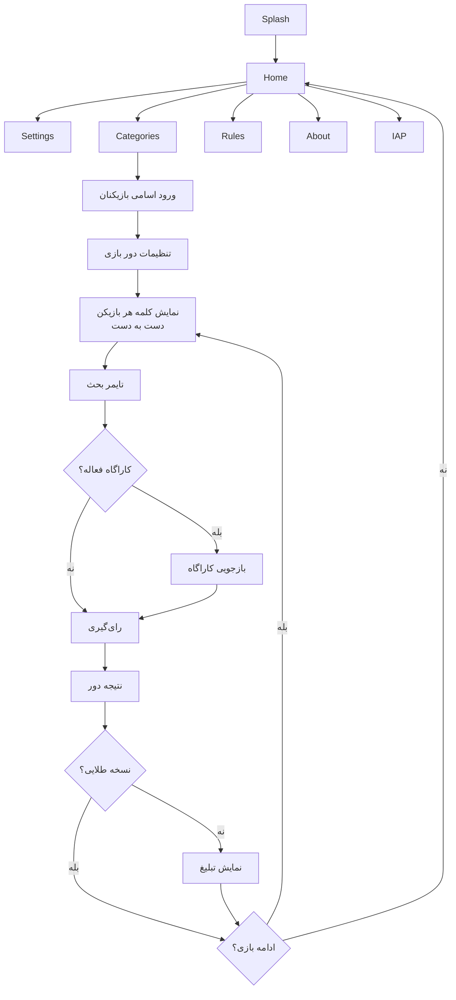
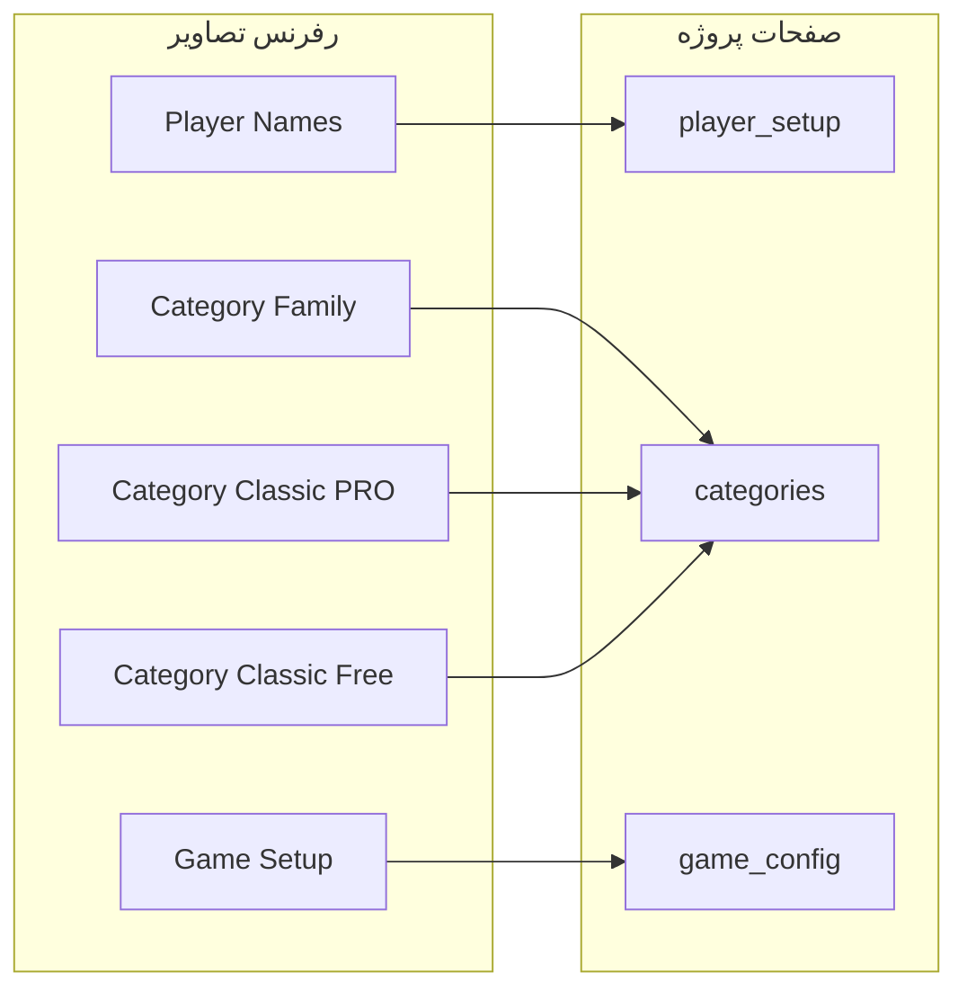

# پلن توسعه بازی جاسوس (Spy Game)

## 1. خلاصه بازی

بازی گروهی رد کلمه (Spy/Impostor). بازیکن‌ها گوشی رو دست‌به‌دست می‌کنن، هر کس نقش و کلمه خودش رو می‌بینه، بعد بحث و رای‌گیری.

---

## 2. نقش‌ها و مکانیک

| نقش | تیم | کلمه رو می‌بینه؟ | توانایی خاص |
|-----|-----|------------------|-------------|

- **شهروند**: تیم شهروندها / کلمه رو می‌بینه / توانایی خاصی نداره
- **جاسوس (مخفی)**: تیم جاسوس‌ها / کلمه رو نمی‌بینه / اختیاری: hint دسته یا کلمه
- **کاراگاه (پولی)**: تیم شهروندها / کلمه رو می‌بینه / یک بار بازجویی قبل از رای‌گیری
- **نفوذی (مخفی، پولی)**: تیم جاسوس‌ها / کلمه رو می‌بینه / جاسوس رو می‌شناسه + به چشم کاراگاه "پاک" دیده می‌شه

**شرط برد:**
- شهروندها: همه جاسوس‌ها حذف بشن
- جاسوس‌ها: تا آخر بازی حداقل یه جاسوس باقی بمونه

---

## 3. فلوی کامل بازی



---

## 4. صفحات (Screens)

هر صفحه در `lib/presentation/screens/<name>/` با فایل screen و provider:

1. **splash** — لوگو و انیمیشن ورود
2. **home** — منوی اصلی (شروع بازی، تنظیمات، قوانین، درباره، IAP)
3. **settings** — تنظیمات کامل بازی (زبان، صدا، ویبره، تایمر پیش‌فرض، ...)
4. **iap** — خرید پکیج طلایی + نمایش وضعیت اشتراک
5. **categories** — انتخاب حالت (کلاسیک/خانوادگی) + انتخاب یک یا چند دسته‌بندی
6. **rules** — قوانین و راهنمای بازی
7. **about** — درباره اپلیکیشن
8. **player_setup** — ورود اسامی بازیکنان + بارگذاری/ذخیره گروه
9. **game_config** — تنظیمات دور (تعداد جاسوس، نقش‌ها، زمان، ...)
10. **word_reveal** — نمایش نقش و کلمه هر بازیکن (pass the phone)
11. **timer** — تایمر شمارش معکوس + دکمه پایان زودهنگام
12. **investigation** — بازجویی کاراگاه (انتخاب بازیکن + نتیجه)
13. **voting** — رای‌گیری (هر بازیکن یه نفر رو انتخاب می‌کنه)
14. **result** — نتیجه دور (کی حذف شد، نقش واقعیش چی بود، برنده کیه)
15. **custom_category** — ساخت دسته‌بندی جدید توسط کاربر

---

## 5. مدل‌های داده (Isar)

### WordCategory
```
id, name, nameEn, type (classic/family), words (list), 
isDefault, isPremium, isUnlockedByAd, wordCount, iconName
```

### Word
```
id, text, categoryId, difficulty
```

### PlayerGroup
```
id, name, playerNames (list), createdAt
```

### GameSession
```
id, categoryIds, playerNames, spyCount, 
hasDetective, hasInfiltrator, timerSeconds,
spyHintEnabled, showCategoryForNonCitizen, spiesKnowEachOther,
gameMode (classic/family), createdAt
```

### PlayerRole (در حافظه، نه Isar)
```
playerName, role (citizen/spy/detective/infiltrator), word, 
isEliminated, votedFor
```

### PurchaseState
```
isGoldenUser, purchaseToken, purchaseDate
```

---

## 6. درآمدزایی

- **4 دسته رایگان:** خوراکی و نوشیدنی، مکان‌ها، ورزش، اشیاء
- **2 دسته با تماشای ویدیو + طلایی:** فیلم و سریال ایرانی، رنگ‌ها
- **12 دسته فقط طلایی:** سلبریتی‌ها، فیلم خارجی، انیمیشن، حیوانات، شهرهای ایران، کشورها، برندها، مشاغل، بازی، تکنولوژی، ابزار، وسایل نقلیه
- **نقش‌های ویژه (کاراگاه + نفوذی):** فقط طلایی
- **تبلیغ بین دوری:** بعد هر دور (مگر طلایی)

پلتفرم‌های انتشار: مایکت، بازار، سیبچه، گوگل‌پلی — IAP از طریق interface مشترک (`lib/core/iap/`)

---

## 7. ساختار فایل‌ها

```
lib/
  main.dart
  core/
    constants/
      app_colors.dart
      game_config.dart          ← تنظیمات پیش‌فرض بازی
    theme/
      app_theme.dart
    router/
      app_router.dart           ← GoRouter routes
    iap/
      iap_service.dart          ← interface
      myket_iap_service.dart
      bazaar_iap_service.dart
      google_iap_service.dart
  data/
    models/
      word_category.dart        ← @collection
      word.dart                 ← @collection
      player_group.dart         ← @collection
      game_session.dart         ← @collection
      purchase_state.dart       ← @collection
      player_role.dart          ← در حافظه (enum + class)
    repositories/
      category_repository.dart
      game_repository.dart
      player_repository.dart
      iap_repository.dart
    datasources/
      isar_datasource.dart      ← init + instance
      default_words.dart        ← کلمات پیش‌فرض
  presentation/
    screens/
      splash/
      home/
      settings/
      iap/
      categories/
      rules/
      about/
      player_setup/
      game_config/
      word_reveal/
      timer/
      investigation/
      voting/
      result/
      custom_category/
    providers/
      game_provider.dart        ← منطق اصلی بازی
      settings_provider.dart
      category_provider.dart
      iap_provider.dart
      audio_provider.dart
    widgets/                    ← Design System (بخش ۹)
      app_card.dart
      segmented_tab.dart
      category_card.dart
      pro_badge.dart
      player_tile.dart
      group_selector.dart
      counter_card.dart
      setting_toggle.dart
      gradient_button.dart
      outlined_action_button.dart
      family_mode_banner.dart
      create_custom_card.dart
      role_card.dart
      timer_widget.dart

assets/
  translations/
    fa.json
    en.json
    ar.json
  audio/                        ← صداها و افکت‌ها
  images/                       ← تصاویر و آیکون‌ها
```

---

## 8. فازبندی پیاده‌سازی

### فاز 1 — پایه (MVP)
زیرساخت: theme، colors، router، Isar init، localization
مدل‌ها: WordCategory، Word، PlayerGroup
صفحات: splash، home، categories، player_setup، word_reveal، timer، voting، result
کلمات پیش‌فرض 4 دسته رایگان
بازی فقط با شهروند + جاسوس

### فاز 2 — تنظیمات و قابلیت‌ها
صفحات: settings، rules، about، game_config
ذخیره/بارگذاری گروه بازیکنان
ساخت دسته‌بندی سفارشی
صدا و ویبره

### فاز 3 — نقش‌های ویژه
کاراگاه + نفوذی
صفحه investigation
منطق بازجویی و تاثیرش روی رای‌گیری

### فاز 4 — درآمدزایی
IAP interface + پیاده‌سازی مایکت/بازار
تبلیغات بین دوری
باز کردن دسته با ویدیو
صفحه IAP
دسته‌بندی‌های پولی

### فاز 5 — پولیش و انتشار
انیمیشن‌ها و UI نهایی
تست روی دیوایس‌های مختلف
انتشار مایکت و بازار

---

## 9. UI/UX Design System (بر اساس رفرنس‌های پیوست)

### سبک کلی
- **تم:** Dark Mode — پس‌زمینه navy تیره (`#0A0B1E` تقریبی)
- **شکل‌ها:** گوشه‌های گرد ۱۶–۲۰dp روی همه کارت‌ها و دکمه‌ها
- **عمق:** کارت‌ها کمی روشن‌تر از پس‌زمینه + border نازک رنگی
- **تایپوگرافی:** sans-serif سفید برای عنوان، خاکستری روشن برای توضیحات
- **فونت فارسی:** Vazirmatn یا IRANSans (پشتیبانی fa/en/ar)

### پالت رنگی (Accent بر اساس context)

| Context | رنگ Accent | کاربرد |
|---------|-----------|--------|
| Default / Setup | بنفش `#8B5CF6` | تنظیمات بازی، دکمه Start، toggleها |
| Classic Mode | آبی `#60A5FA` | کارت‌های رایگان، نقطه تعداد کلمات |
| Family Mode | صورتی `#EC4899` | تب Family، بنر توضیح، toggle تصاویر |
| Premium / PRO | طلایی `#D4AF37` | badge قفل، border دسته‌های پولی |
| Danger | قرمز `#EF4444` | دکمه Remove بازیکن |

همه رنگ‌ها در [`lib/core/constants/app_colors.dart`](lib/core/constants/app_colors.dart) — بدون hardcode.

### کامپوننت‌های مشترک (`lib/presentation/widgets/`)

| Widget | توضیح | رفرنس |
|--------|-------|-------|
| `AppCard` | کارت تیره با border و radius | همه صفحات |
| `SegmentedTab` | تب Classic / Family Mode | categories |
| `CategoryCard` | grid 2 ستونه، نام + تعداد کلمات + badge | categories |
| `ProBadge` | آیکون قفل + متن PRO | دسته‌های پولی |
| `PlayerTile` | آواتار حرف اول + نام + #index + X | player_setup |
| `GroupSelector` | dropdown گروه ذخیره‌شده | player_setup |
| `CounterCard` | آیکون + عنوان + عدد (بازیکن/جاسوس) | game_config |
| `SettingToggle` | آیکون + عنوان + Switch بنفش | game_config, settings |
| `GradientButton` | دکمه تمام‌عرض با gradient بنفش | Start Game |
| `OutlinedActionButton` | دکمه Add/Remove با outline | player_setup |
| `FamilyModeBanner` | بنر صورتی + toggle تصاویر رنگی | categories (family) |
| `CreateCustomCard` | کارت ویژه با border طلایی | categories |

### نقشه صفحات به رفرنس



**player_setup** (تصویر ۱):
- کارت انتخاب گروه ذخیره‌شده (مثلاً «خودمونی») با border بنفش
- کارت تعداد بازیکن (۵ Players / ۳–۱۰۰)
- لیست بازیکنان: آواتار حرف اول + نام فارسی + شماره + دکمه حذف
- دکمه‌های Add (بنفش) و Remove (قرمز) در پایین

**categories** (تصاویر ۲، ۴، ۵، ۶):
- Segmented control: Classic | Family Mode
- حالت Family: بنر صورتی با توضیح + toggle «نمایش تصاویر رنگی»
- Grid 2 ستونه کارت دسته‌بندی
- هر کارت: نام دسته + تعداد کلمات (نقطه رنگی + «X words»)
- دسته PRO: badge قفل طلایی گوشه بالا-راست + border طلایی
- دسته سفارشی: کارت «Create Custom» با border طلایی و آیکون
- انتخاب چند دسته: border glow روی کارت انتخاب‌شده

**game_config** (تصویر ۳):
- دو کارت کنار هم: تعداد بازیکن | تعداد جاسوس
- بخش Categories: لینک به صفحه دسته‌ها + toggleهای قوانین
- Toggleها: نمایش دسته به جاسوس، راهنمای کلمه، جاسوس‌ها همدیگر را بشناسند
- دکمه Start Game با gradient بنفش

> **نکته:** رفرنس «Question Game» دارد — پروژه ما فقط **Word Game** است. Question Game فعلاً خارج از scope.

### حالت Family Mode — تفاوت UI
- accent صورتی به‌جای بنفش/آبی
- بنر توضیحی بالای grid
- toggle «نمایش تصاویر رنگی» (اختیاری فاز ۲+)
- کلمات ساده‌تر (داده، نه UI)

### حالت Premium — تفاوت UI
- border و badge طلایی روی کارت‌های قفل
- tap روی PRO → bottom sheet با گزینه «تماشای ویدیو» یا «خرید طلایی»
- دسته‌های باز شده با ویدیو: badge متفاوت (مثلاً آیکون play)

### انیمیشن‌ها (فاز ۵)
- fade + slide بین صفحات
- scale tap روی کارت‌ها
- pulse روی دکمه Start Game
- flip card در word_reveal (نمایش نقش/کلمه)
- countdown animation در timer
